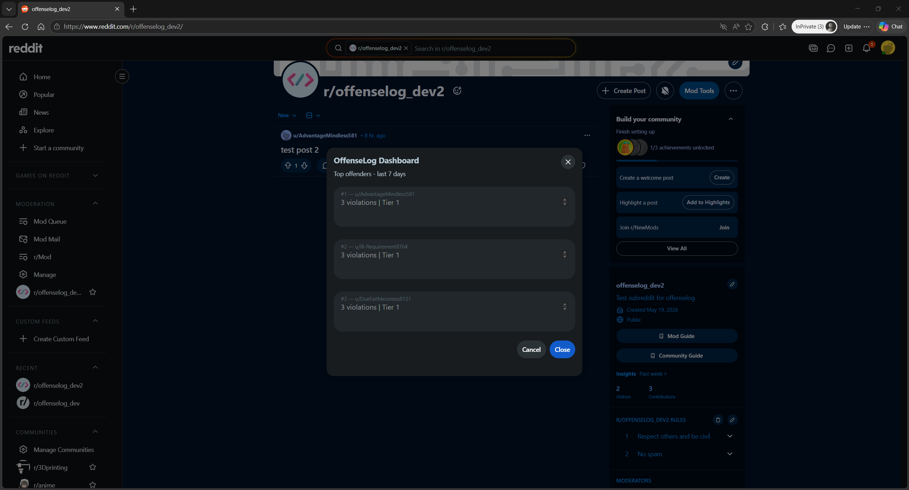
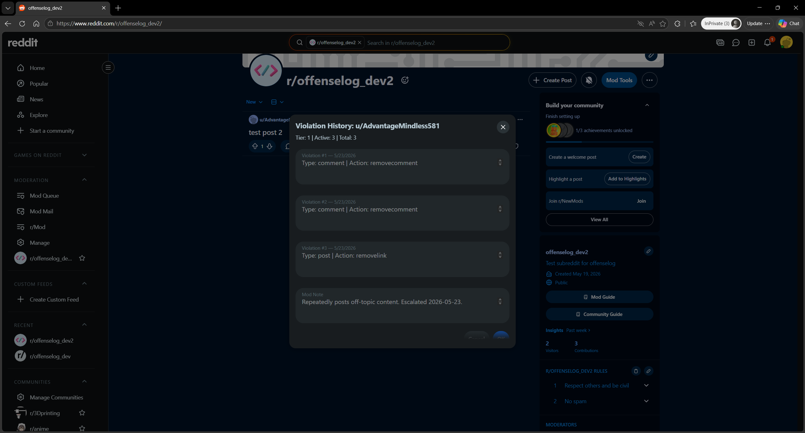
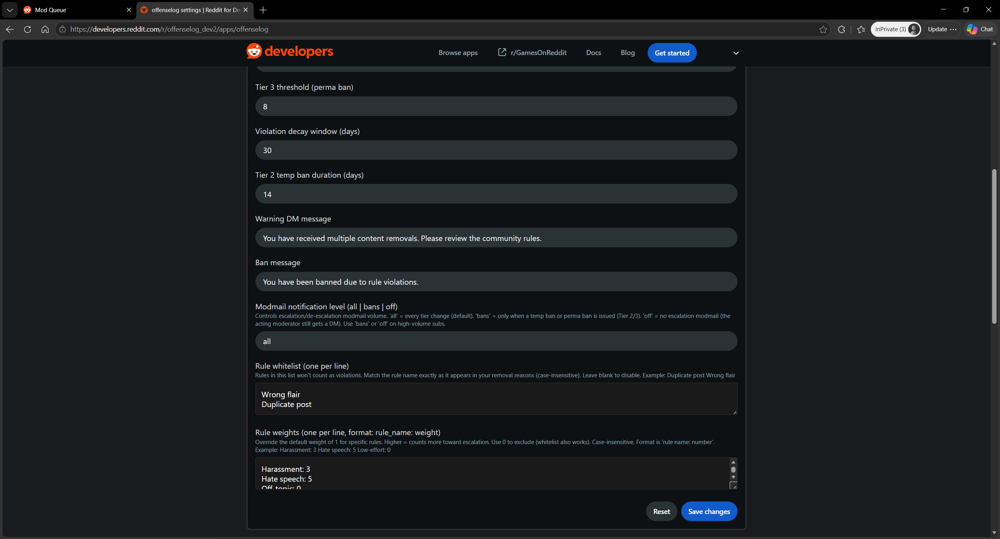
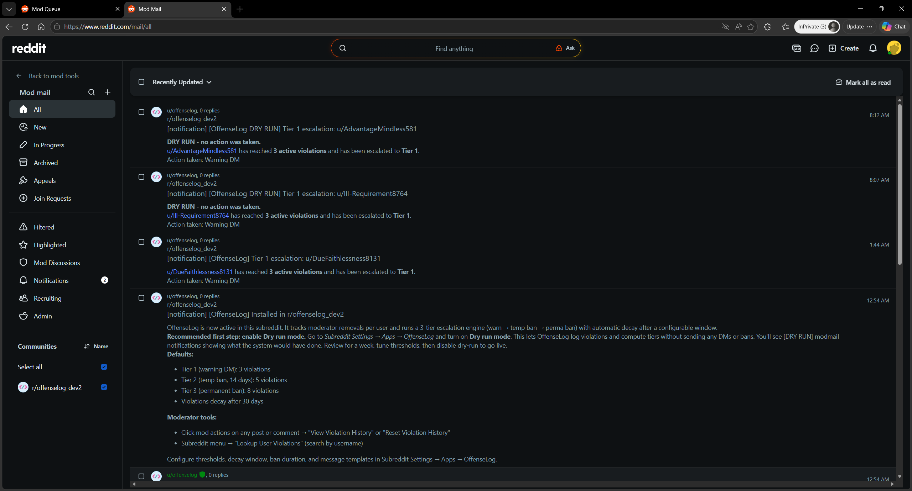

# OffenseLog

> Automatic violation tracking and tiered escalation for Reddit moderators. Built on Devvit for Reddit's [Mod Tools Migration hackathon](https://mod-tools-migration.devpost.com/) — replacing the parts of Toolbox and RES that moderators miss most on the new Reddit.

OffenseLog watches mod actions in real time, logs every removal against the user, and automatically escalates through a configurable three-tier system: warning DM → temp ban → permanent ban. Violations decay after a configurable window, so a single bad day doesn't follow someone forever. Everything is per-subreddit configurable, and a dry-run mode lets you preview behavior for a week before going live.

## Demo

### Top Offenders Dashboard


### Violation History


### Per-rule Weighting


### Modmail Escalation Notification


## Why OffenseLog

Most active subreddits on the new Reddit have lost Toolbox and RES — and with them, the basic ability to track who's been warned, who's been removed how many times, and who's been sliding for months. A subreddit with 10 removals per week translates to 520 violations to track per year, by hand. OffenseLog handles this automatically and adds capabilities the old tools never had: per-rule weighting, automatic escalation, dry-run preview, and rule whitelisting.

## Toolbox Migration Mapping

If you're coming from Toolbox or RES, here's how features map:

| Toolbox / RES feature | OffenseLog equivalent |
|---|---|
| Usernotes (sticky notes on users) | **Edit Mod Note** — accessible from any post or comment, surfaced in violation history |
| Removal reasons + history | **View Violation History** — every removal logged with rule, mod, timestamp, direct permalink |
| User search by username | **Lookup User Violations** — subreddit menu, no post/comment needed |
| Manual offense counting | **Automatic tier tracking** with three configurable thresholds |
| Modmail context on bans | **Auto-modmail** on every escalation with active count + tier + action taken |
| Custom button DMs | **Configurable warning + ban DM templates** in subreddit settings |
| Modlog grep for repeat offenders | **OffenseLog Dashboard** — top 10 offenders this week, with current tier |
| Manual cleanup of old removals | **Automatic decay** after a configurable window |
| *(no equivalent)* | **Per-rule whitelisting + weighting** — count harassment 3×, ignore "wrong flair" |
| *(no equivalent)* | **Backfill from modlog** — import your last 7 days on install |
| *(no equivalent)* | **Dry-run mode** — preview a week of behavior before enforcement |

## Features

### Tracking & Escalation
- **Real-time violation logging** — `remove*` and `spam*` mod actions captured the moment they happen
- **Three-tier escalation** — warning DM (Tier 1) → temp ban (Tier 2) → permanent ban (Tier 3), all thresholds configurable
- **Per-rule weighting** — assign weights to specific rules ("Harassment: 3") or whitelist rules that shouldn't count at all
- **Race-condition-safe** — concurrent mod actions on the same user can't double-escalate (Redis SETNX lock with try/finally release)
- **AutoModerator & mod-on-mod ignored** — only human-on-user actions count
- **Acting-mod DM** — the mod who triggered an escalation gets a private DM summarizing what action was taken

### Decay & Cleanup
- **Time-based decay** — violations older than the configurable window are excluded from tier calculations
- **De-escalation** — when violations age out and a user drops a tier, they get a "back in good standing" DM
- **Daily cron cleanup** — scheduled task prunes expired violations and content-index keys every night at 4 AM
- **Auto-cleanup on re-approval** — approving a removed post automatically deletes its violation

### Operator Controls
- **Dry-run mode** — log violations and compute tiers without sending any DMs or bans; modmail notifications still fire prefixed with `[DRY RUN]`
- **Modmail volume control** — `all` (every tier change) / `bans` (Tier 2/3 only) / `off` (no escalation modmail)
- **Manual tier override** — set any user's tier directly from a context menu
- **Per-violation deletion** — remove a single violation from a user's record (recalculates tier automatically)
- **Manual reset** — wipe a user's entire violation history with a confirmation form

### Visibility
- **Top offenders dashboard** — top 10 users by violations in the last 7 days, with their current tier
- **Full violation history per user** — date, type, action, rule, acting mod, and direct permalink to the removed content
- **Mod notes** — sticky notes on any user, visible to all mods in the violation history view
- **User lookup** — search any user by name from the subreddit menu, no post or comment needed
- **Welcome modmail on install** — full feature tour + recommended onboarding flow

### Adoption
- **Backfill from modlog** — import the last 7 days of removals so existing repeat offenders don't start at zero
- **Silent backfill** — imported violations update tier but never trigger DMs or bans for past activity
- **Rule-attach tracking** — when a mod adds a removal reason after a removal, it's auto-attached to the matching violation

## Quick Start

```bash
git clone https://github.com/Darch22/offenselog.git
cd offenselog
npm install
npm run login
npm run dev
```

Then in your dev subreddit:

1. **Enable dry-run mode** in Subreddit Settings → Apps → OffenseLog → *Dry run mode*. Recommended for the first week.
2. **Backfill the last 7 days** from Subreddit menu → *Backfill from Modlog*.
3. **Open the dashboard** from Subreddit menu → *OffenseLog Dashboard* to confirm violations are being tracked.
4. After a week of dry-run review, disable dry-run to start enforcement.

## Configuration

All settings live under Subreddit Settings → Apps → OffenseLog:

| Setting | Type | Default | Description |
|---|---|---|---|
| Dry run mode | boolean | `false` | Log violations + compute tiers but send no DMs or bans. Recommended for week 1. |
| Tier 1 threshold | number | `3` | Weighted score needed to trigger a warning DM |
| Tier 2 threshold | number | `5` | Weighted score needed to trigger a temp ban |
| Tier 3 threshold | number | `8` | Weighted score needed to trigger a permanent ban |
| Decay window (days) | number | `30` | How far back violations are counted as active |
| Tier 2 ban duration (days) | number | `14` | Length of the Tier 2 temporary ban |
| Warning DM message | string | *(default)* | Body of the Tier 1 warning DM |
| Ban message | string | *(default)* | Body of the Tier 2/3 ban message |
| Modmail level | string | `all` | Modmail volume: `all` / `bans` / `off` |
| Rule whitelist | paragraph | empty | Rules that don't count (one per line, case-insensitive) |
| Rule weights | paragraph | empty | Format: `rule name: number` per line, case-insensitive |

### Rule weighting example

In *Rule whitelist*:
```
Wrong flair
Duplicate post
```

In *Rule weights*:
```
Harassment: 3
Hate speech: 5
Off-topic: 0
```

With these settings, two Harassment removals (2 × 3 = 6) push a user straight to Tier 2 without needing 5 separate violations. Wrong-flair and duplicate-post removals are tracked but never escalate.

## Architecture

```
src/
├── index.ts                    # App entry; mounts route groups
├── core/
│   ├── violations.ts           # Redis CRUD for violation records, tier state, mod notes
│   ├── escalation.ts           # Tier threshold check + DM/ban dispatch
│   └── rules.ts                # Whitelist + weight parsing, weighted scoring
└── routes/
    ├── forms.ts                # Form submission handlers
    ├── menu.ts                 # Context menu handlers
    ├── scheduler.ts            # Nightly decay cleanup
    └── triggers.ts             # onAppInstall + onModAction event handlers

tests/
├── rules.test.ts               # Whitelist / weight / scoring
├── escalation.test.ts          # Tier threshold transitions
├── integration.test.ts         # End-to-end scenarios combining rules + escalation
└── violations.test.ts          # Redis-mocked addViolation logic
```

## How It Works

### Violation lifecycle

1. A mod removes a post or comment. The `onModAction` trigger fires.
2. OffenseLog filters out AutoModerator and mod-on-mod actions (mod list is cached for 1 hour to avoid hammering Reddit's API), then records a `Violation` in Redis as a sorted-set entry scored by timestamp.
3. A separate `addremovalreason` event later attaches the rule name to the matching violation.
4. After each mod action, OffenseLog recomputes the user's weighted score from active (non-decayed) violations and determines their new tier.

### Weighted scoring

Each active violation contributes a weight to the user's score:
- Whitelisted rule → 0
- Configured weighted rule → user-specified weight
- Empty rule (not yet attached) or unconfigured rule → 1 (default)

Total score is compared against the three tier thresholds.

### Escalation

When a user's new tier is *higher* than their stored tier, OffenseLog:
1. Atomically claims an escalation lock for that user (`SET NX`) to prevent concurrent handlers from double-escalating
2. Sends the appropriate Tier 1 / 2 / 3 action (DM, temp ban, or perma ban)
3. Notifies the acting mod via DM with a summary
4. Posts a modmail notification (gated by the `modmailLevel` setting)
5. Releases the lock in a `finally` block

### De-escalation

When active violations drop and the new tier is *lower* than the stored tier — either via approval or via decay — the stored tier is updated. If the user falls to Tier 0, they get a "back in good standing" DM. Modmail notification is gated by `modmailLevel === 'all'`.

### Backfill

The Backfill menu item iterates the last N days (capped at 7) of modlog entries, filters to removal/approval/addremovalreason actions, and dedups against existing records using a content-id index. After all entries are processed, each affected user's tier is recomputed silently — no DMs or bans fire for past activity.

### Dry-run

When dry-run is on:
- Redis state still gets written (violations logged, tiers tracked)
- No DMs sent, no bans issued, no user-facing good-standing DMs
- Modmail notifications still fire, prefixed with `[DRY RUN]`
- Lets mods preview a week of behavior, tune thresholds, then go live

## Moderator Tools

### Context menu on posts and comments
- **View Violation History** — full record + rule notes + permalinks + mod note
- **Reset Violation History** — wipe a user with confirmation
- **Override Tier** — manually set a user's tier (0–3)
- **Delete Violation** — remove one violation; tier recalculates automatically
- **Edit Mod Note** — sticky note visible to all mods

### Subreddit menu
- **OffenseLog Dashboard** — top 10 offenders this week
- **Lookup User Violations** — search any user by name
- **Backfill from Modlog** — import past mod actions (one-time, capped at 7 days)

## Tech Stack

- [Devvit](https://developers.reddit.com/) — Reddit's platform for building moderation apps
- [Hono](https://hono.dev/) — Lightweight HTTP router for internal endpoints
- [Redis](https://developers.reddit.com/docs/redis) — Sorted sets for time-ordered violation storage
- [Vite](https://vite.dev/) — Server bundle build
- [Vitest](https://vitest.dev/) — Unit and integration testing
- [TypeScript](https://www.typescriptlang.org/) — Strict mode throughout

## Commands

| Command | Description |
|---|---|
| `npm run dev` | Starts Devvit playtest with live reload |
| `npm run build` | Builds the production server bundle |
| `npm test` | Runs the Vitest test suite |
| `npm run type-check` | TypeScript compilation check |
| `npm run lint` | ESLint over `src/` |
| `npm run deploy` | type-check + lint + test + upload to Reddit |
| `npm run launch` | Deploy and submit for Reddit's public app review |

## Testing

```bash
npm test
```

The test suite covers the escalation brain end-to-end:
- **`rules.test.ts`** — whitelist parsing, weight parsing, scoring edge cases
- **`escalation.test.ts`** — tier threshold transitions, including decimal weights from per-rule scoring
- **`integration.test.ts`** — scenarios combining rules + escalation, e.g. "two harassment violations weighted 3 jump straight to Tier 2"
- **`violations.test.ts`** — `addViolation` dedup logic with mocked Redis

## Permissions

OffenseLog requires `reddit: true` for:
- Sending warning DMs
- Issuing temp and permanent bans
- Posting modmail notifications
- Reading posts, comments, and the modlog (for context + backfill)

All menu items are restricted to the `moderator` user type. Settings are subreddit-scoped.

## License

BSD-3-Clause. See [LICENSE](LICENSE).
